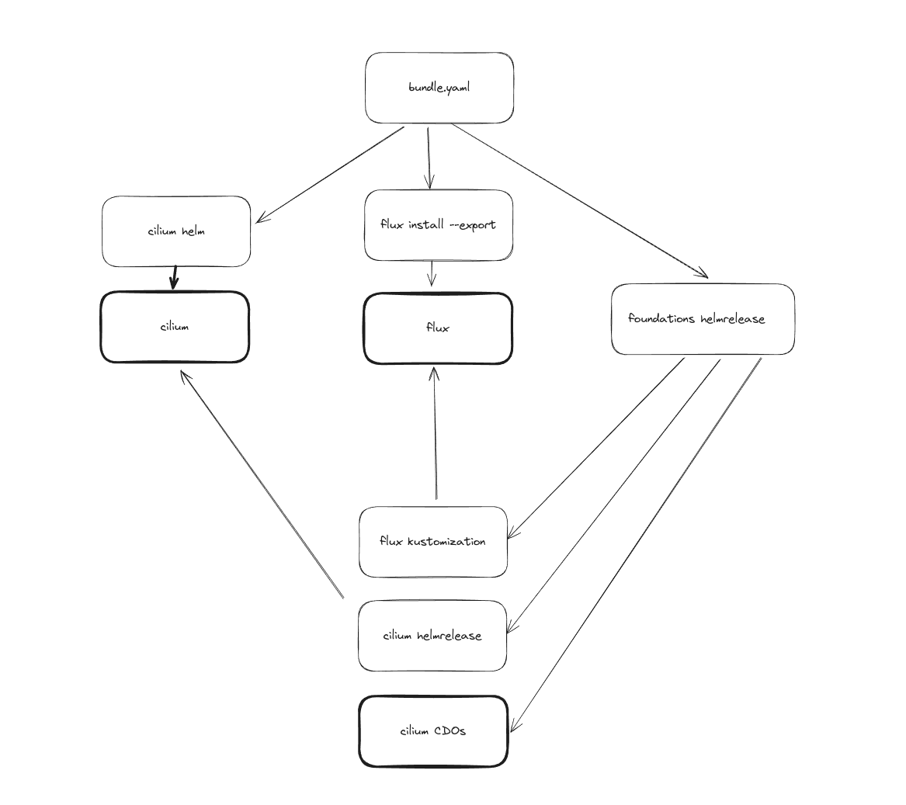

KRAUD CLOUD ENTERPRISE FOUNDATIONS
==================================


An opinionated foundational set of services for managed kubernetes.
We manage, tests, audits and support this stack for our customers.

It is available to the public as a learning example only.
Pull requests will be ignored.


| chart | version |
|---|---|
| cert-manager | 1.15 |
| cilium | 1.15 |
| flux | 2.3 |
| haproxy | 1.4 |
| longhorn | 1.6 |
| openebs | 4.1 |
| prometheus | 56.8 |


## Bootstrapping



In a clean cluster, edit `bootstrap/user-skeleton.yaml` then run `./bootstrap/bootstrap.sh`

## Upgrading

### Flux

```sh
flux install --export --namespace foundations > flux/flux.yaml
```

Then the source stuff will pick it up and it will auto-upgrade

### Other components

Upgrade the respective helm version in `./charts/foundations/templates`
